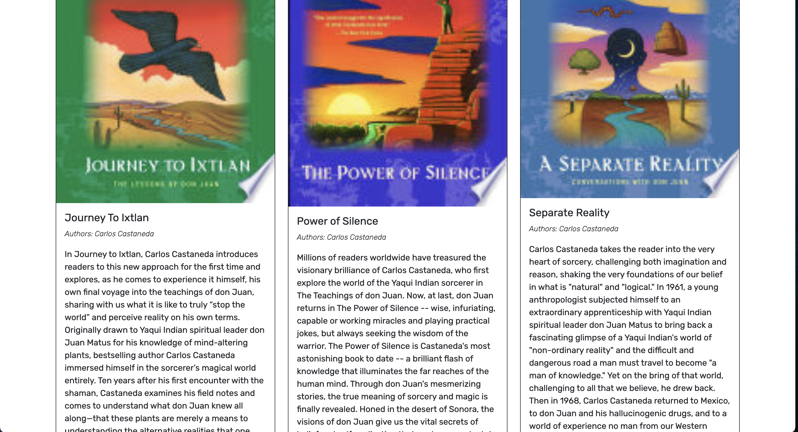

# Book Search Engine using MERN Stack

Week 21 Challenge (MERN)

## Table of Contents

- [Description](#description)
- [Technologies Used](#technologies-used)
- [Installation](#installation)
- [Features](#features)
- [Usage Information](#usage-information)
- [Suggested Future Development](#suggested-future-development)
- [Contribution Guidelines](#contribution-guidelines)
- [Test Instructions](#test-instructions)
- [License](#license)

## Description

This application has been refactored to use GraphQL typeDefs, resolvers, and an Apollo Server, replacing the previous routing and Express setup. The backend utilizes MongoDB with a mix of Mongoose and GraphQL queries and mutations to interact with the database.

The refactoring process has provided a deeper understanding of the benefits of using GraphQL with React, simplifying frontend routing and making the codebase cleaner.

Deploying to Heroku presented challenges, particularly in connecting MongoDB. To achieve this, an account through MongoDB Cloud Atlas was set up, roles were assigned, and a connection string was obtained, which was then added as a Config Var in Heroku settings.

## Screenshots

## Technologies Used

This application is built using JavaScript and relies on the following technologies:

- React.js (v16.13.1)
- Node.js (v16.19.1)
- Express.js (v4.17.2)
- GraphQL (v15.8.0)
- Apollo Server (3.11.1)
- MongoDB
- CSS and Bootstrap (v5.2.3) for styling.

## Installation

To work with the codebase, follow these steps:

1. Clone the repository from [GitHub](https://github.com/Donsidious/MERN-Book-Search-Engine).
2. Run `npm install` in the root directory of the terminal to install the necessary dependencies.
3. Enter `npm run develop` to start a live server where you can make real-time edits to the codebase.

Alternatively, you can access the live application directly via the Heroku link: [Live Application](https://mern-book-search-engine15-94a7abdc0a8a.herokuapp.com/).

## Features

Key features of the site include:

- Single-page application structure created with React.
- User-friendly navigation with links in the navigation bar.
- Book search using the Google API.
- Ability to save or delete books to/from user profiles.

## Usage Information

This application is user-intuitive. Simply visit the [site](https://mern-book-search-engine15-94a7abdc0a8a.herokuapp.com/), navigate through pages using the navigation bar links, and explore the content.

## Suggested Future Development

Future developments for the application could include:

-Introducing a Dark Mode toggle for improved user experience in low-light environments.

-Ongoing refinement and expansion of the user interface to provide a more engaging and polished experience.

-Creating additional pages to facilitate interactions between users, such as profile interactions.

-Expanding the range of CRUD (Create, Read, Update, Delete) operations to provide more comprehensive functionality.

## Contribution Guidelines

Contributions are welcome. To collaborate, open an issue, make changes on a feature branch, and await approval before merging into the main branch.

NOTICE: Contributor Covenant is released under the Creative Commons Attribution 4.0 International Public License, which requires attribution.

## Test Instructions

Currently, there are no unit tests written for this application.

## License

NOTICE: This application is covered under the MIT License.
